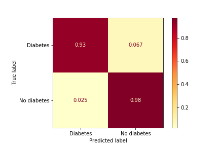
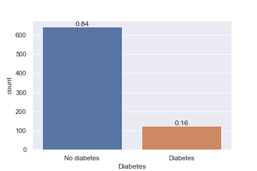
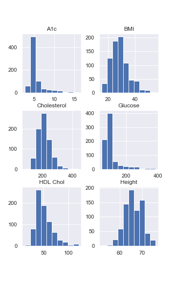
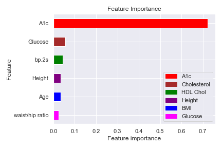
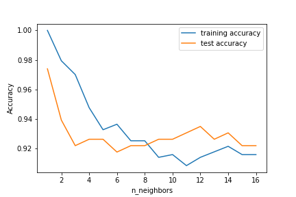

# Final Project
> Diabetes Awareness is the title of our final Data Analytics Boot Camp project. Our team name is Ram-rod. Team members include, Ryan Muir, Melissa Memel, Lance Weston, Rosalind White and David Stagner. We will incorporate many of the technologies and libraries we have learned in our Data Analytics Boot in this project. We worked together as a team to complete all necessary work for the final deliverables.

## Table of contents
- [Final Project](#final-project)
  - [Table of contents](#table-of-contents)
  - [General info](#general-info)
  - [Screenshots](#screenshots)
  - [Technologies](#technologies)
  - [Setup](#setup)
  - [Features](#features)
  - [Status](#status)
  - [Inspiration](#inspiration)
  - [Contact](#contact)

## General info
Our group wanted to create a health related interactive web-page with data visualizations using Tableau and a machine learning algorithm to quantify an individual's risk for diabetes based on their own health information inputs. The risk assessment tool is intended to only provide the user with a non-medical result suggesting they are at low or high risk for diabetes and should consult their primary care physician or other qualified medical practitioner for a full assessment on their health.

## Screenshots
  DO WE WANT TO ADD SCREENSHOTS

## Technologies
* Python - Pandas
* Python Matplotlib
* Scikit-Learn
* HTML/CSS/Bootstrap
* Tableau
* SQL Database
* Heroku

## Setup
The project is accessible through Heroku. 

## Features
List of features ready and TODOs for future development
* Machine learning algorithm that predicts risk for type II diabetes.
* Tableau Story with visualizations of both datasets used in this project.
* Web-page that incorporates both the machine learning risk predictor and the tableau visualizations.
* Multiple web-page links for additional resources related to diabetes.

To-do list:
* We would like to add additional risk predictors for other health maladies, such as; heart disease and stroke.
* ANY OTHER IDEAS FOR TO-DO FEATURES?

## Status
Project is: Complete

## Inspiration
We are all interested in health and healthcare topics. Diabetes is a serious health condition that can lead to many other health problems, especially if managed poorly. All of our team members have family members affected by Diabetes. It is important that we focus on health issues that we can manage and control to some level to promote good health, quality of life and longetivity.

## Contact
Created by:
* Ryan Muir (RyanAdrianMuir@gmail.com) Github (ramuir)
* Melissa Memel (melissamemel90@gmail.com) Github (melissamemel)
* Lance Weston (Lance.weston@gmail.com) Github (Lweston75)
* Rosalind White (Roswhite34@yahoo.com) Github (Roz0716)
* David Stagner (dstagner63@icloud.com) Github (dstagner63)
